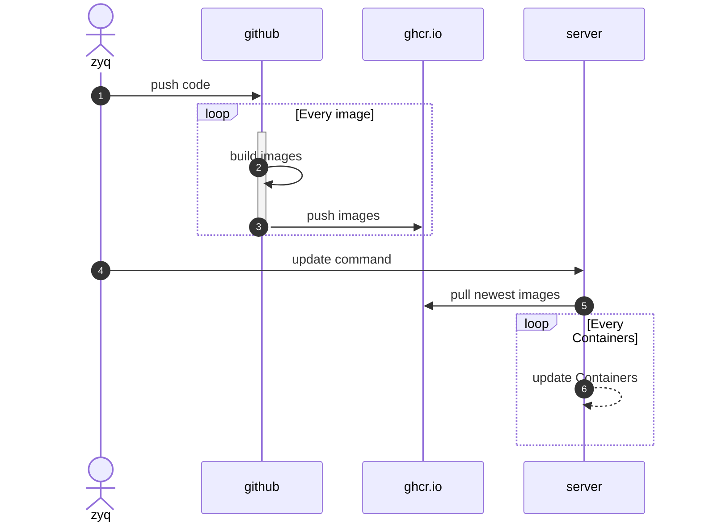

# BigThree

## 环境依赖

- java:8
- mysql:8.0.28
- node:14.18

---      

## docker 部署

### 部署

```shell
cd ops/docker
docker compose up -d
```

### 更新

```shell
docker compose pull
docker up -d
```

### 清理

```shell
docker compose down -v --rmi all
```

## todo k8s 部署

---

## 目录结构描述

- ops: 存放所有的部署相关的文件
    - build
        - mysql
            - sql 预执行sql
            - Dockerfile mysql images build
        - frontend nginx config backup
    - docker/docker-compose.yml docker compose 部署文件
    - k8s k8s部署的yml
        - mysql
            - mysql pv
            - mysql pvc
            - mysql.yml
        - backend/backend.yml
        - frontend/frontend.yml
- test: 存放所有的测试文件 测试的http文件
- backend: 存放所有的后端相关的文件
    - main: 存放所有的后端主要文件
    - test: 单元测试文件
- frontend: 存放所有的前端相关的文件
    - nginx: 存放所有的nginx config
    - src: 存放所有的前端主要文件
    - public: 存放所有的前端静态文件
- .github/workflows: 存放所有的github actions相关的文件
    - maven.yml: Build and push Docker image
    - node.js.yml: Build and push Docker image
    - mysql.yml： build mysql 
    - codeql-analysis.yml: 代码检查

---

## 流程



---

## 版本内容更新
